# PSFlyCast


## PSFlyCast is a passion project, not a piracy project.

It exists so you can play the games you own on the console you own.

- **Piracy is not condoned.**
- **No games, BIOS files, console firmware or decryption keys are included, and they never will be.**
- **Use only legally obtained backups of games you own**, made yourself from your own discs.
- **Use only BIOS files dumped from hardware you own.**
- **Requests for, or links to, games, BIOS files, firmware or keys are not welcome** in this project's issues or discussions.

---

A Dreamcast, NAOMI, NAOMI 2 and Atomiswave emulator for a jailbroken PS5:
[Flycast](https://github.com/flyinghead/flycast) as a native app with its own
icon on the home screen, a controller-only interface in the style of Steam's
Big Picture mode, and the emulator's Vulkan renderer drawing through RADV from
[PS5_Vulkan](https://github.com/mihawk-99/PS5_Vulkan) /
[PS5_Mesa](https://github.com/mihawk-99/PS5_Mesa), linked into the app.

PSFlyCast is an unofficial port. It is not made or supported by Flycast's
developers: report its problems here, not to them.

**[The user manual](MANUAL.md)** says how to install it, add games and use
everything in it.

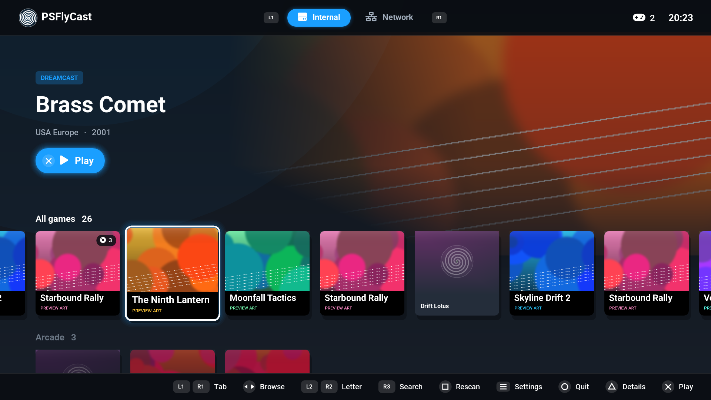

| | |
|---|---|
| 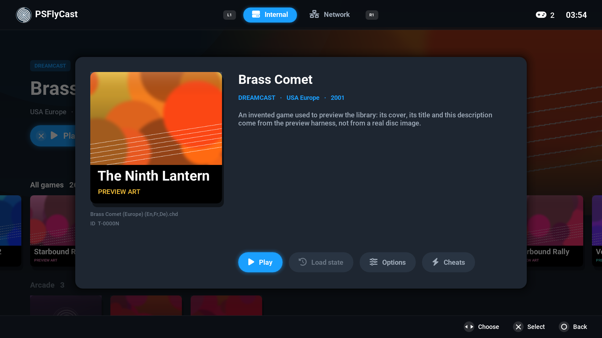 | 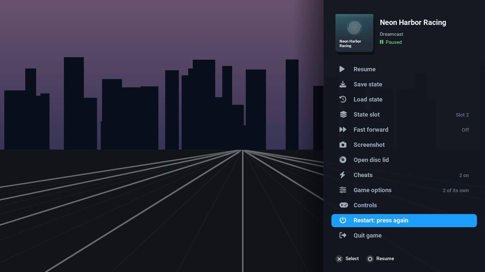 |
| 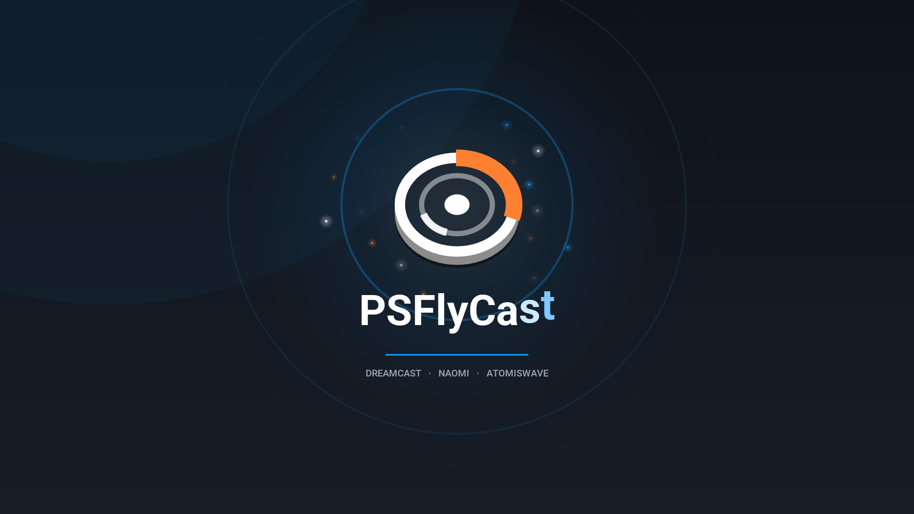 | 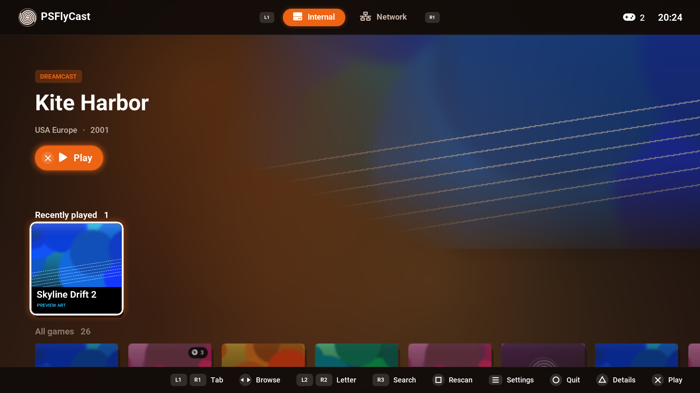 |
| 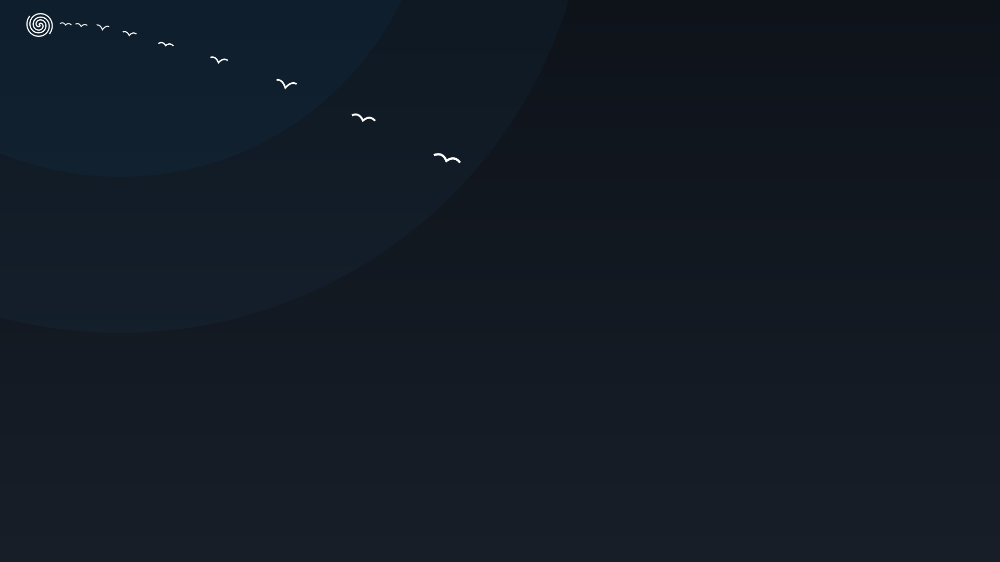 | 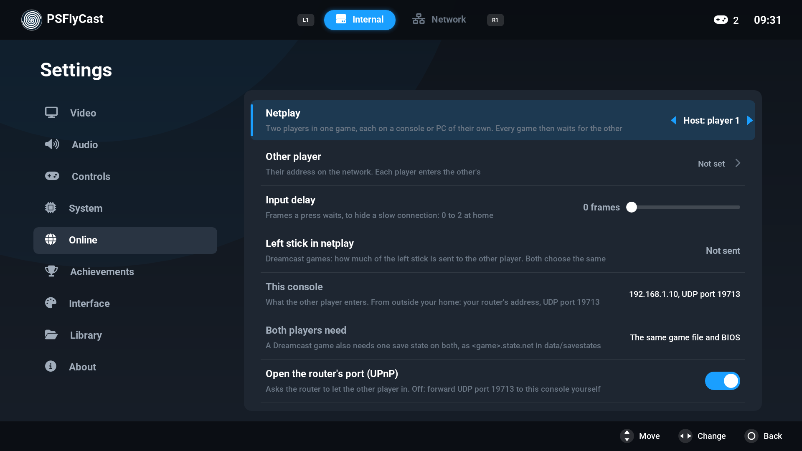 |
| 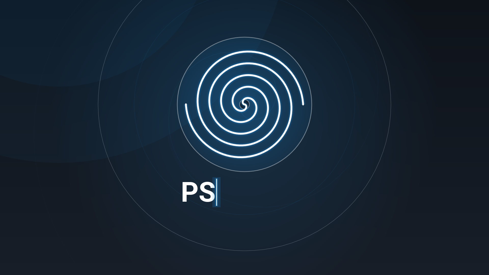 |  |
| 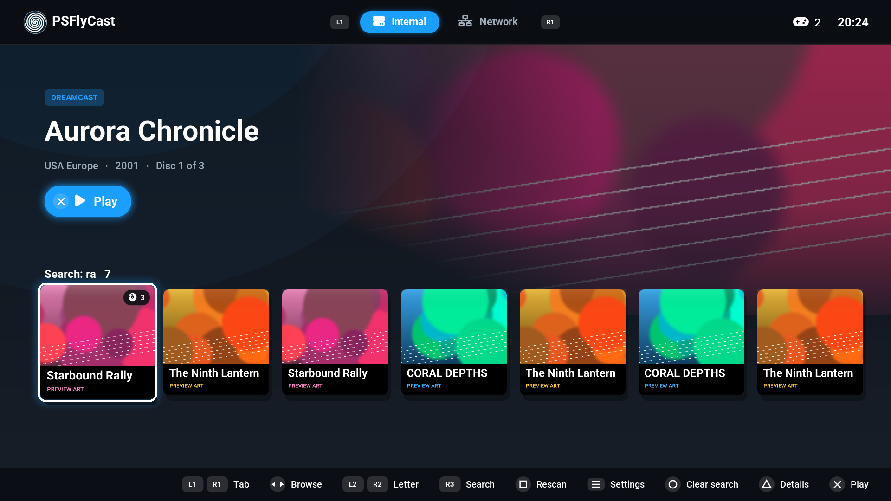 | 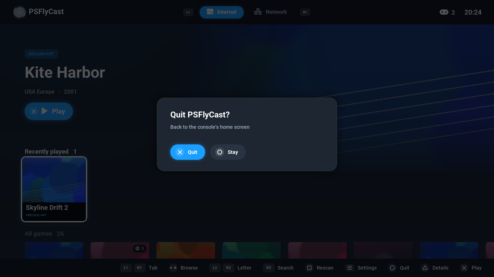 |
| 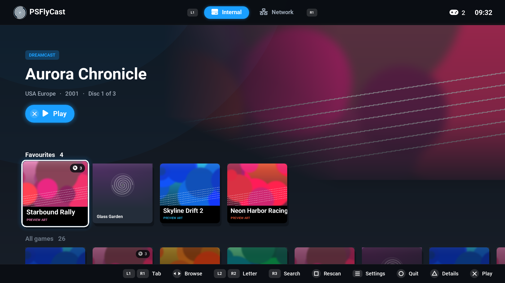 | 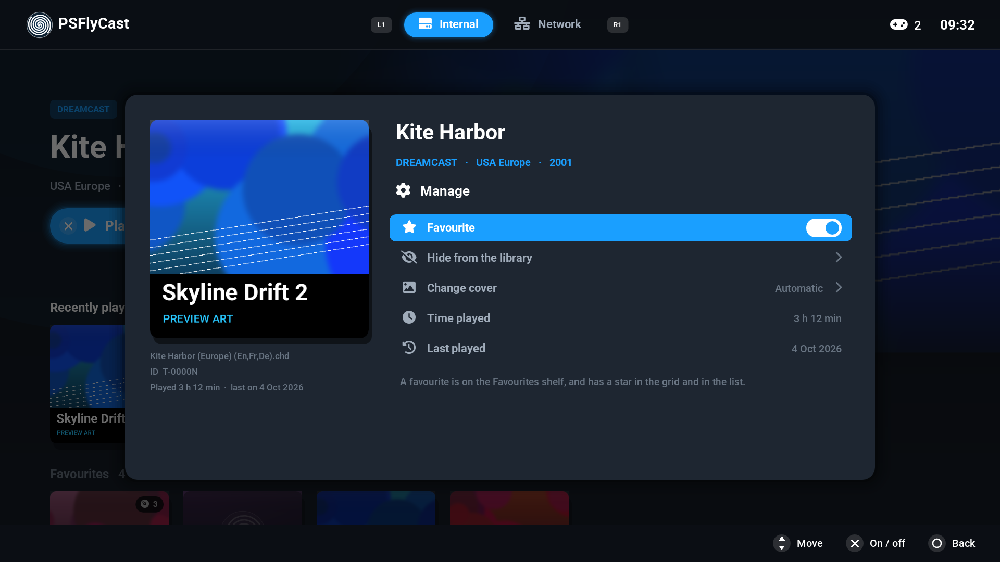 |
| 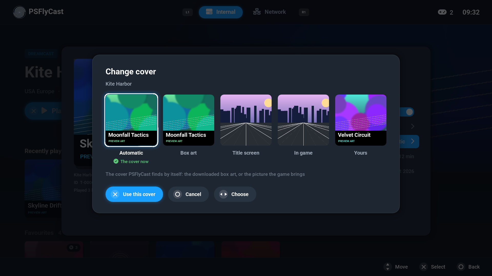 | 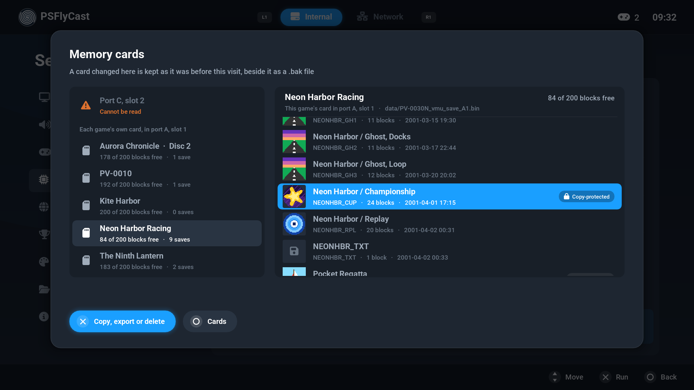 |
| 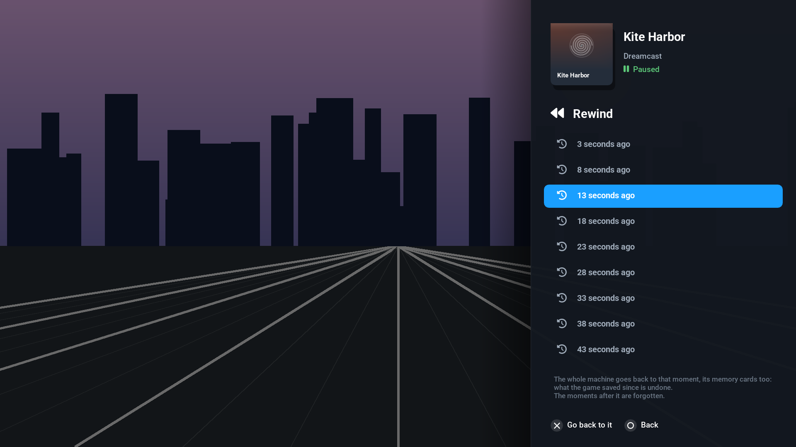 | 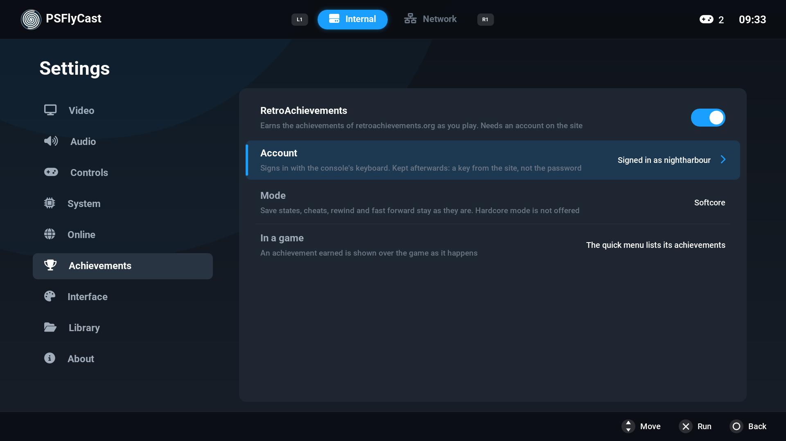 |

## Status

Latest release: **v1.1.0** (build 47). It is built
on Flycast's `dev` branch, the one Flycast's nightly builds are made from.

Played on a PS5 over the builds that led to v1.0.2: Dreamcast games from the
internal folder and from a network share, with a real BIOS; save states made
by v1.0.0; cover downloads; the quick menu and the per-game options; games on
several discs, grouped and swapped from the quick menu; the library; the
mark made of one spiral line, with the start-up animations and their sound;
PSFlyCast updating itself from a release, whose files replaced the ones in
the title's folder; 119.88 Hz output on a display that takes it, and
60 frames a second on one that shows fewer than its mode says; the three
frame pacing choices; internal resolution above 6x and the texture options;
FSR 1 upscaling; per-pixel transparency with 32 to 128 layers, with its HUD
and menus at 3x and 4x; object draw distance, with which objects appeared
from further away. And on v1.0.2 itself: leaving PSFlyCast from the library;
searching the library on the console's keyboard, and the keyboard for the
netplay address and the name online; the menu sounds and the sound on the
console's home screen; aiming a light gun with the touch pad and by turning
the controller; the light bar in the player's colour. And on v1.1.0, in
its build 42 (build 44, the candidate, differs from it by what
[New in v1.1.0](#new-in-v110) lists under "In the candidate"): the title as built on PS5_VulkanTemplate's stack starts,
lists the library and runs games as v1.0.2 did, with the saves and settings
v1.0.2 left; the memory card manager; favourites, hidden games and time
played; Change cover; the Scanlines and CRT picture filters; the software
renderer; a USB keyboard and mouse as the Dreamcast's; the left stick as
the joystick in arcade games. No frame rates or audio were measured. On the
first candidate (build 44): v1.0.2 found it, installed it and restarted into
it when asked. And on a test build made between the two candidates
(build 45), on a 3840x2160 display at 119.88 Hz: the title starts and plays
the new start-up sound; frame generation as that build had it, with which
three games played for two to seven minutes each ran at 99% to 100% of full
speed - two that draw about 30 pictures a second, with 76 to 81 more a
second made in between, and one that draws 60, with 60 made; and the speed
readout those numbers are from. And on the second candidate (build 46),
which the release (build 47) differs from in its name and number only: the
start-up animations start as they should; Per-pixel layers; and frame
generation as the release has it, with which fast games smear little
enough to be acceptable and the delay it adds is not noticeable. No speed
was written down on build 46.

New in v1.1.0 and not confirmed on a console: RetroAchievements; rewind;
fast forward; the memory card's screen in a corner of the picture, and
Stretch to fill; 120 Hz output with USB drives on; and what the first
candidate adds to build 42. [New in v1.1.0](#new-in-v110) says what each
is.

From v1.0.2 and still not confirmed on a console: the Dreamcast's language
set from the console's; and variable refresh rate, which is off until it is
turned on.

In earlier builds and still not confirmed on a console: a second, third and
fourth player joining while the title runs; names looked up for the games'
own online modes and for network shares; Settings > Online, with Flycast's
netplay; per-pixel transparency above 4x; USB drives; the skins and
transitions; the letter jump; the Controls page; Restart game and the CPU
clock. With per-triangle
sorting a game can show surfaces flickering in and out; per-pixel draws them
right.

> **No games, BIOS files or keys come with PSFlyCast, and none ever will.**
> Use only backups you made yourself of games you own, and BIOS files dumped
> from your own console. See `LEGAL.txt`.

If something fails, `flycast-boot.log` says where. Its first lines name the
build, as does Settings > About.

## New in v1.1.0

Status, above, says which of it has been run on a console.

Added:

- **RetroAchievements** (Settings > Achievements): the achievements of
  retroachievements.org, earned as you play, through Flycast's own support
  for the site. Softcore only: hardcore mode is not offered. See
  [Achievements](#achievements).
- **Rewind** (Settings > System, off by default, experimental): a game's
  last three minutes are kept in memory, and the quick menu goes back into
  them. See [Controls](#controls).
- **A memory card manager** (Settings > System > Memory cards): the saves
  on each card, copied to another card, deleted, and taken to and from
  files. See [Memory cards](#memory-cards).
- **Favourites, hidden games, time played and last played**, under
  **Manage** in a game's details, with a Favourites shelf in the library
  and Settings > Library > Show hidden games.
- **Change cover**, under Manage too: the collection's box art, title
  screen or picture of a moment of play, the cover PSFlyCast finds by
  itself, or your own picture.
- **Fast forward** in the quick menu, and as a control that can be put on a
  button of the controller.
- **Scanlines** and **CRT**, two picture filters in Settings > Video >
  Upscaling.
- **Software renderer** (Settings > Video, or for one game; experimental):
  the picture computed on the CPU by a software model of the Dreamcast's
  graphics chip.
- **Memory card screen** and **Stretch to fill** in Settings > Video.
- **Frame generation** (Settings > Video, or for one game; experimental, off
  by default): pictures made in between the game's own, for the presents
  that would show a picture again - a 30 fps game on any TV, a 60 fps game
  at 120 Hz. Light makes one between two of the game's, Full as many as the
  TV shows. PSFlyCast's own: it finds how each part of the picture moved,
  from the last frame to this one and back, and where it cannot it shows
  the game's picture as it is. See the manual for what it costs.
- **Four start-up animations**, one each start, made to a new start-up
  sound: see [Skins, backgrounds and motion](#skins-backgrounds-and-motion).
- **Show frame rate** also says how fast the game really runs, as a
  percentage of full speed, and how many of the pictures shown were made by
  frame generation; the same goes to `flycast-boot.log`, with the slowest
  ten seconds.
- **Per-pixel layers** (Settings > Video, 8 to 128) is an option of its own,
  and Transparency sorting has its three choices in one row: per-triangle,
  per-strip, per-pixel.
- A folder, `vmu/`, for memory card saves as files.

Changed:

- The emulator is Flycast's `dev` branch at
  `4dca1988dab56f603c2309e8882e264252fa7c8f`; v1.0.2 had
  `f83fda7069ee7a32e206cb5092c38fd0216d80af`. That is 16 commits of
  Flycast's, among them a fix to the synchronisation between render passes
  and frames in the Vulkan per-pixel transparency renderer, checks of the
  buffer lengths in a save state and of the packets netplay and DCNet
  receive, and the Stretch to fill option.
- The build uses the stack of
  [PS5_VulkanTemplate](https://github.com/mihawk-99/PS5_VulkanTemplate):
  newer revisions of PS5_Vulkan, PS5_Mesa and the payload SDK fork, which
  [Building](#building) names.
- The link step refuses a build that imports a function no module a title
  loads exports. Such an import links, and is null at run time: its first
  call would stop the title.
- With USB drives on, PSFlyCast runs outside its sandbox, where there is no
  `/app0` for the driver to read the title's `param.json` from. The title
  now names the file to the driver, so that 120 Hz output can be taken
  there too.
- Every request PSFlyCast makes over the web says what it comes from:
  `PSFlyCast/1.1.0 (PlayStation 5) Flycast/<Flycast's version>`.
- From Flycast's open pull requests, each named with its number there:
  two players' netplay of a Dreamcast game or of a game from a CDI, GDI or
  CUE image no longer ends in "Peer verification failed" (the checksum both
  sides compare was taken of a memory address, not of the file: #2513; it
  works between two copies that have the fix); a status bit of the
  Dreamcast's processor that a game had set is cleared as on the console,
  which stopped a game from going back to the BIOS (#2531); a CHD image
  with over-long text in its track list can no longer write past the
  memory set aside for it (#2384, made where this build reads CHDs); the
  pointer no longer jumps when a game changes between the two ways a mouse
  reports (#2528); a trigger that reports as a button is recognised when a
  control is given a button (#2213); and what is read from a disc's
  directory, a compressed save state, a name server's answer, an arcade
  game's file list and the other player's packets is checked before it is
  used (#2414, #2415, #2416, #2519, #2520, #2521).
- The updater knows release candidates: `v1.1.0-rc1` is older than
  `v1.1.0-rc2`, and both are older than `v1.1.0`. A release's build is
  offered releases only; a candidate's build is offered the next candidate
  and the release.
- In the candidate (build 44) and not in build 42: the fixes above, the
  updater's candidates, a newer payload SDK and libsmb2
  ([Building](#building)), and the quick menu's Screenshot row and control
  taken out again: the console's Create button takes screenshots.
- In the second candidate (build 46) and not in the first: frame
  generation, the four start-up animations and their sound, the speed in
  Show frame rate, and Per-pixel layers. The release (build 47) is the
  second candidate with its name and number changed.
- `flycast-boot.log` has a line starting `storage:` for each of the folders
  a title may be given (`/app0`, `/download0`, `/data`, `/data/homebrew`,
  `/user/data`): whether it is there, and whether a file can be made in it.
  They are for a later version, which may
  keep what is yours outside the title's folder. Nothing is moved or kept
  anywhere else yet.

## What you need

- A jailbroken PS5 with [ShadowMountPlus](https://github.com/drakmor/ShadowMountPlus)
  (or another launcher that runs titles from `/data/homebrew/`). No HEN payload
  is needed by PSFlyCast itself.
- Your own games (`.chd`, `.gdi`, `.cdi`, `.cue`; NAOMI/Atomiswave `.zip`/`.7z`)
  and, optionally, your own BIOS dumps.

No games, BIOS files or keys come with PSFlyCast.

## Install

1. Copy the `PPSA99247` folder to `/data/homebrew/PPSA99247/`. When updating,
   copy it **over** the one that is there (overwrite the files): your games,
   saves and covers are inside that folder, so do not delete it first.
2. Wait for ShadowMountPlus to report the title ready, then launch **PSFlyCast**.
3. Copy your games into `/data/homebrew/PPSA99247/games/` and press **Square**
   in the library to scan.

## The library's tabs

**L1 / R1** go through the tabs at the top, round and round:

| Tab | Shows |
|---|---|
| **Internal** | The games in `games/` in PSFlyCast's folder |
| **USB** | The games on USB drives. Only there when Settings > Library > USB drives is on |
| **Network** | The games on the SMB share named in `network.cfg` |

Each tab keeps its own place, and PSFlyCast opens on the tab you used last.
The Settings are not a tab: **OPTIONS** opens them from the library, and
closes them again.
Square scans the open tab again.

## Where your files go

Everything is in the title's own folder, `/data/homebrew/PPSA99247/`
(which the app sees as `/app0`):

| Folder | What |
|---|---|
| `games/` | Your games |
| `bios/` | BIOS files (optional) |
| `covers/` | Covers: downloaded ones, and your own |
| `network.cfg` | The network shares to read games from |
| `cheats/` | Cheat files (`.cht`); the libretro database's Dreamcast set is included |
| `patches/` | Game patches (60 FPS, widescreen): your own `patches.txt`; none is included |
| `data/` | Saves, VMUs, save states, which cheats are on, each game's shader list; favourites, hidden games and time played (`library.txt`) |
| `vmu/` | Memory card saves as files: where the memory card manager exports them to, and where it looks for the ones to add (`.vmi` with its `.vms`, or `.dci`) |
| `sounds/` | `startup.wav`, the start-up sound; a WAV file of your own there plays in its place |
| `update/` | Only while an update is on its way: the download, and the version before it until the new one has started |
| `radv-shader-cache/` | The graphics driver's compiled shaders |
| `flycast-boot.log` | Each start-up step, and a crash report if the app stops |
| `logs/flycast.log` | The emulator's own log |

- **BIOS:** Dreamcast games start without one (the emulator's built-in BIOS), but a
  real `dc_boot.bin` and `dc_flash.bin` are more compatible. NAOMI and
  Atomiswave games need their BIOS zips (`naomi.zip`, `awbios.zip`...).
- **Covers:** downloaded from the libretro thumbnails collection by the game's
  file name (Redump names such as `Game (USA).chd` match), from GitHub or,
  when that does not answer, from thumbnails.libretro.com; else read from
  the disc image. To use your own, put `<game file name>.png` (or `.jpg`) in
  `covers/`. Settings > Library turns downloading off.
- **Descriptions:** with downloads on (Settings > Library), each game's
  description and release date come from TheGamesDB, through Flycast's own
  scraper: a local disc is looked up by the ID on the disc, a game on the
  network share by its file name (the share is not read for this).
- **Game details (Triangle in the library):** the description, and five
  actions. **Play**; **Load state** starts the game from one of its saved
  states; **Options** gives the game settings of its own (resolution,
  widescreen, region, cable and others: each follows the Settings until you
  change it here); **Cheats** picks the cheat file and switches cheats on
  before the game starts; **Manage** is below. Options and cheats are kept under the ID the emulator
  reads from the game, so a network or arcade game has to be started once
  before they can be set. While a game that has options of its own runs,
  changes made in Settings are kept for that game only. Under the cover are
  the file's name, the game's ID, and how long the game was played and when
  last.
- **Manage (in Game details):** five rows, new in v1.1.0.
  - *Favourite.* A favourite is on a **Favourites** shelf of its tab, after
    Recently played, and has a star in the grid and in the list.
  - *Hide from the library.* The game leaves every list, the search's too.
    Settings > Library > **Show hidden games** lists the hidden ones again,
    dimmed and marked with a struck-through eye, and the same row, now
    **Show in the library again**, brings one back. Settings > Library >
    Hidden games counts them. Nothing is deleted.
  - *Change cover* opens the choice of covers, below.
  - *Time played* and *Last played.* The time counts while the game itself
    runs: not in the quick menu, nor in the Settings. A game last started
    by an earlier version says "Before play time was kept".

  A game on several discs is one game for all of these: every disc is a
  favourite or hidden with it, and their times are added up. It is all kept
  in `data/library.txt`.
- **Change cover:** up to five pictures side by side. **Automatic** is the
  cover PSFlyCast finds by itself: the downloaded box art, or the picture
  the game brings. **Box art**, **Title screen** and **In game** are the
  three pictures the libretro thumbnails collection keeps under a game's
  file name, downloaded when the choice opens; **Yours** is your own
  picture from `covers/`, when there is one. Left and right choose, Cross
  uses the picture, Square asks again for one that could not be downloaded.
  The collection's pictures are of Dreamcast discs, so for an arcade game
  the three cannot be chosen, and downloads have to be on (Settings >
  Library). Every disc of a game takes the cover chosen (with Yours, each
  disc that has a picture of yours takes its own). Your own picture
  is never deleted: while another cover has its place it is put aside in
  `covers/.yours/`, and Yours puts it back. The downloaded pictures are
  kept in `covers/.choices/`.
- **Cheats:** also in a game, touch pad > Cheats. The closest-named cheat file
  is loaded with every cheat off; switch on the ones you want, or pick another
  file with left/right on the first row. Your own `.cht` files go in `cheats/`.
- **Your own logo:** a picture saved as `logo.png` in PSFlyCast's folder (square,
  with a transparent background) is shown in place of PSFlyCast's turning mark.
- **USB drives:** Settings > Library > USB drives, then restart PSFlyCast. Games
  are read from a folder named `flycast` or `dreamcast` (also `dc`, `naomi`,
  `atomiswave`, `arcade`) at the top of the drive. This needs elfldr listening
  on port 9021 (the payload loader kstuff setups run): PSFlyCast sends it the
  bundled `sandbox-elevator.elf`, which lets PSFlyCast out of its sandbox.
  Cover downloads may stop working while this is on, and with them what
  else needs HTTPS: the update check and the achievements.
- **Network share (SMB):** edit `network.cfg` in PSFlyCast's folder (PSFlyCast
  writes a template the first time it runs):

  ```
  path = 192.168.1.10/Games/Dreamcast
  user = guest
  password =
  ```

  `path` is server/share/folder, with the server given by its IP address (a
  name is not looked up on the console); add a `path` line for each folder. For an
  open share leave `user = guest` and the password empty; otherwise give the
  NAS account. The share is only read.

  - **When the share is asked.** The first time you open the Network tab the
    folder is scanned, and the list of games is kept (`data/network-games.txt`).
    After that the tab shows the kept list without touching the share: a NAS
    whose disks sleep is not woken by starting PSFlyCast or by browsing. The
    share is asked again when you press Square on the tab (or use Settings >
    Library > Scan for games) and when you start one of its games or insert
    one of its discs. A scan the share did not answer to the end is not kept,
    and is made again the next time the tab is opened. Covers of network
    games are downloaded by file name; their discs are not read for a
    picture.
  - **A sleeping NAS.** A server that is on gets a minute to answer each
    request, and the screen says "Waiting for the network share (12 s)" while
    its disks spin up; Circle cancels. A server that is off, or a wrong
    address, fails after five seconds.
  - **Load network games into memory** (Settings > Library, on by default).
    On: the whole game is read into memory before it starts, with a progress
    bar, and the share is not used again while you play, so the NAS can go
    back to sleep. It takes about as long as copying the file over your
    network. Off: the game starts at once and is read
    from the share while it runs; a NAS that falls asleep during play will
    stall the game until its disks are back. A disc inserted from the quick
    menu is read the same way. Up to 3 GB is kept in memory (a Dreamcast
    disc is 1.2 GB at most); a file beyond that is streamed, and
    `flycast-boot.log` says so.
  - If nothing shows up, the tab says what the share answered, and
    `flycast-boot.log` has the lines starting `smb:`.
- **120 Hz:** on a TV that takes 4K at 120 Hz, PSFlyCast runs the output at
  119.88 Hz and shows each frame of the game for two refreshes, so a frame
  that arrives late is 8 ms late instead of 17, and the menus draw at 120.
  On any other TV the output is 59.94 Hz. Settings > About > Display says
  which one you got, and `flycast-boot.log` has the driver's own line
  (`display: the driver:`) and, a few seconds after the start, how many
  frames the menus really presented a second.
  - *VRR.* With VRR on, a display refreshes when a frame arrives, between 48
    and 120 Hz, and idles at 48 Hz before anything is shown. The driver takes
    that reading for a display in the 119.88 Hz mode, not for one that
    refused it.
  - *Settings > Video > 120 Hz output* turns it off (from the next start of
    PSFlyCast), should a display take the mode badly.
  - *With USB drives on.* The driver asks for 119.88 Hz only when the
    title's `param.json` allows it, and reads that file from `/app0`.
    Outside the sandbox, where PSFlyCast runs with USB drives on, there is
    no `/app0`: from v1.1.0 the title names the file to the driver, so the
    mode can be taken there too. Not confirmed on a console yet.
- **A game that draws wrong, or shows nothing:**
  - *Native depth interpolation* (Settings > Video, on by default). The console's graphics chip is AMD's, as in the Xbox, and without
    this option wall and floor textures warp and flicker as you move in
    some games. Flycast has it on for the Xbox for the same
    reason.
  - A real BIOS (`dc_boot.bin` and `dc_flash.bin` in `bios/`) starts games
    the built-in one does not. Settings > About > Dreamcast BIOS says which
    one is in use.
  - Every option of the Settings that can differ from game to game can be
    set for one game only: before it starts in Details > Options (Triangle
    on a game), and while it runs in the quick menu's Game options.
  - `flycast-boot.log` describes each game's first minute: the lines
    starting `game:` give what it was started with and, every five seconds,
    how many frames it drew, whether the picture was on, and where its
    program was. A game that stays black either draws black frames or waits
    for something, and those lines say which.
- **Shaders:** the first time a game shows a new effect there is a short
  hitch while it is compiled. PSFlyCast remembers what each game used and
  prepares all of it when the game next starts.

## If it does not start

Send `flycast-boot.log` from `/data/homebrew/PPSA99247/` (and
`flycast-boot.1.log`, the run before). It is written line by line as the app
starts, so it is there even when the app is closed with an error, and it ends
with a crash report saying where the app stopped.

PSFlyCast shows no notifications of its own on the console. To have one when
it crashes ("PSFlyCast stopped...") or when USB drives cannot be read, set
`notifications = 1` in `frontend.cfg` in its folder; the log has the same
lines (`notice: ...`) either way.

## Controls

**Library**

| Button | Does |
|---|---|
| L1 / R1 | Previous / next tab: Internal, USB, Network |
| D-pad / left stick | Browse |
| L2 / R2 | Jump by letter: R2 to the first game of the next letter, L2 to the first of this one, then of the one before. The letter shows for a moment |
| Cross | Play |
| Triangle | Game details: description, load state, the game's own options, cheats, and Manage (favourite, hide, cover, time played) |
| Square | Scan the open tab again |
| R3 (press the right stick) | Search: the console's keyboard opens, and the tab shows the games whose title has every word typed |
| Circle | With a search: every game again. Without: leave PSFlyCast, after asking |
| OPTIONS | Settings. (The view - shelves, grid or list - is chosen there: Library > Library view) |

While a game loads, Circle cancels.

**In a game**

| DualSense | Dreamcast | Arcade |
|---|---|---|
| Cross / Circle / Square / Triangle | A / B / X / Y | Buttons 1 / 3 / 2 / 4 |
| L2 / R2 | Analog triggers | Analog triggers |
| L1 / R1 | Z / C | Buttons 6 / 5 |
| OPTIONS | Start | Start |
| Left / right stick | Analog stick / second stick | Left: analog stick, or the joystick |
| D-pad | D-pad | Joystick |
| L3 / R3 | | Insert coin / Service |
| **Touch pad click** | **Quick menu** | **Quick menu** |

The **quick menu** pauses the game: resume, save and load states (10 slots,
with a picture of each), rewind (when it is on), fast forward,
change discs, cheats, achievements (when they are on), game options, controls,
restart the game, and quit it. Circle or the touch pad resumes. Up to four DualSense controllers
work, one per logged-in user.

In an arcade game with a digital joystick (most of them) the **left stick
moves the joystick** as the D-pad does; a game with a wheel, a flight stick or
a light gun keeps it as the analog stick. Settings > Controls > "Left stick as
D-pad" is Automatic (that), On (every game, Dreamcast ones too) or Off, and a
game can have its own choice.

**Light guns.** In an arcade light-gun game the gun follows the left stick,
as in Flycast. Settings > Controls > **Light gun aiming** makes it follow a
finger on the touch pad (the pad is the screen, and the gun stays where the
finger left it) or the controller's motion sensor (turn and tilt the
controller; about 40 degrees cross the screen, and a touch on the pad puts
the gun back in the middle). **Motion aiming direction** swaps a direction
that goes the wrong way, and **Light gun crosshair** shows where each gun
points. The buttons stay as they are. A Dreamcast game played with a light
gun needs one in the port: the game's own options (Details > Options, or the
quick menu) have **Port A: Light gun**, from the game's next start. Not
confirmed on a console yet.

**A USB keyboard and a USB mouse** plugged into the console are the
Dreamcast's keyboard and mouse: when a Dreamcast game starts, the keyboard
takes the first port no controller has and the mouse the one after it, for
that game. Settings > Controls > Controllers says what is connected, and
**USB keyboard and mouse** turns it off. The menus are driven by the
controller only. Not confirmed on a console yet.

Each controller's **light bar** shows its player: blue, red, green, pink
(Settings > Controls turns that off).

**Restart game** loads the game again from its beginning, as the console's
power button would: asked twice (press Cross again within four seconds), as
what was not saved is lost. The options that wait for a start (region,
cable, BIOS, patches, the controller's second slot) take effect with it,
and "Auto load state" is passed over for that one start.

**CPU clock** (Game options, and Settings > System for every game) runs the
Dreamcast's processor slower or faster than its 200 MHz, from 100 to
400 MHz. Overclocking smooths a game that slows down or whose frame rate
is uneven; it does not make a 30 fps game run at 60, and some games break
or run too fast with it. It takes effect when the game resumes.

**Rewind** (experimental, off by default) goes back a little way in a game.
With Settings > System > **Rewind** on, a snapshot of the whole machine is
taken every 5 seconds of play, as Save state would make one, and the last
3 minutes of them are kept, compressed, in memory: 384 MiB at most, the
oldest dropped first. The quick menu then has **Rewind**, a list of those
moments, the newest first ("8 seconds ago"); Cross goes back to one and the
game goes on from there. The memory cards go back with the machine, so what
the game saved since is undone, and the moments after the one chosen are
forgotten. The time is time of play: the menus do not count. The moments
are also forgotten when a state is loaded, the disc is changed, or the game
starts, ends or goes online. There is no rewind in netplay, while a game is
online, or between linked arcade boards. `flycast-boot.log` has what it
does, in the lines starting `rewind:`. Not confirmed on a console yet.

**Fast forward**, in the quick menu, lets the game run without being held
to its own pace, with no sound, until it is turned off there again or the
game is quit. It is Flycast's own. On this console the display still holds
it: every frame is shown for one refresh, so with 120 Hz output a game that
runs at 60 frames a second can reach at most about twice its speed, and
with 60 Hz output nothing is gained. Not in netplay, online or between
linked arcade boards. Not confirmed on a console yet.

Screenshots are the console's: its Create button takes them, of games here
as of anything else.

**Controls**, in the quick menu, changes which DualSense button is which
Dreamcast (or arcade) one, for the running game: Cross on a control, then
the button for it. A button that did something else stops doing it, and
shows as "Not set" until it is given one. L2 and R2 stay analog when a
trigger is put on them; the sticks and the touch pad (the quick menu) are
not changed. The first change gives the game a layout of its own, kept
with the emulator's controller mappings and loaded whenever the game starts;
the Layout row at the top puts the game back on the layout every game has
(Settings > Controls restores that one to its default). The layout is the
DualSense's: every pad plays with it. The last row is the emulator's own,
**Fast forward** (a press turns it on, the next one off): it is on no
button until it is given one, and Square takes it off its button again.
L3 and R3 are free in Dreamcast games.

**Game options** are the running game's own, and hold every setting the
Settings have for a game: what you change there is in effect when the game
resumes (a few options, marked, when it is next started), is kept for that
game only and leaves the Settings as they are. (Vibration and the stick's
dead zone belong to the controller and are the same for every game.) A
dot marks an option the game has of its own; Square puts one back to the
Settings' value. The Settings for every game are in the library.

**Games on several discs.** Each disc is a file of its own, named as dumps
are: `Game (USA) (Disc 1).chd`, `Game (USA) (Disc 2).chd` (also `Disk B`,
`CD2`, `Disc 2 of 4`, with or without brackets). The files of one game, on
one source, are shown as one entry with the number of discs on its cover.

- Play starts the disc you last played, or disc 1 the first time. Details
  (Triangle) shows the discs; Square goes to the next one, and Play, Load
  state, Options and Cheats are then that disc's.
- When the game asks for the next disc: touch pad, **Open disc lid**, touch
  pad again, **Insert disc**. The game's own discs are listed first, with
  the one after the disc in the drive already chosen; every other disc
  image is below.
- The memory card goes by the ID on the disc too, so where the discs share
  it (most games) the save carries over. Save
  states are kept per disc. Options and cheats are kept under the ID on the
  disc, which the discs of most games share (Details shows it).
- Settings > Library > Group the discs of a game turns the grouping off;
  each disc is then an entry, as before.

**Game patches: 60 FPS and widescreen.** PSFlyCast can apply patches of the
kind the community's
[Flycast widescreen and 60 FPS chart](https://github.com/nexus382/Flycast-Widescreen-Compatability-And-Cheat-Chart)
collects: codes that make a game draw a 16:9 picture itself, or run at 60
frames a second. They are apart from cheats: a game that has one gets a
switch for it, **60 FPS patch** or **Widescreen patch**, at the top of its
options (Details > Options before it starts, the quick menu's Game options
while it runs), off until you turn it on, and working with whatever cheat
file the game has. A change takes effect the next time the game starts.

**No patches come with a release.** The chart states no licence, so its codes
are not mine to pass on. To use them, make the list yourself from the chart
and put it in `patches/` in PSFlyCast's folder:

```sh
python3 shell/ps5/patches/make_patches.py "<chart>/Dreamcast Widescreen.md" \
    "<libretro-database>/metadat/redump/Sega - Dreamcast.dat" > patches.txt
```

Without a `patches/patches.txt` the switches are not shown.

- A patch belongs to one version of a game, and the game file is recognised
  by its name: the Redump name (`Game (USA).chd`), or just the title
  with `(USA)`, `(Europe)` or `(Japan)`. A demo, a beta, a limited edition
  or a release in one language is another build and gets a patch only where
  the chart has one for it.
- The chart is a work in progress: a patch may do nothing or break a game.
  Turn it off again if so. A 60 FPS patch can make a game run too fast.
- Flycast has widescreen codes of its own for many games (Widescreen game
  patches, in Video); the Widescreen patch is for a game that option does
  nothing for.
- The list is one patch a line, and can be added to by hand.
- `make_patches.py` does not read the chart's arcade lists (NAOMI,
  Atomiswave).

**Object draw distance (experimental).** Two Dreamcast games (the option's
own line in the app names them) make a
stage's objects exist only near the player, by a distance each kind of object
has in a table, which is why they appear a short way ahead on a Dreamcast as
here. A game's options have **Object draw distance** (off, 1.5x to 5x): while
the game runs, PSFlyCast looks through its memory for those tables and
multiplies their distances, and gives the objects that are on the game's own
distance (taken to be 400 units) that distance multiplied (`shell/ps5/ps5_drawdist_scan.h` says how they are
recognised; the idea is the PC version's "Higher Draw Distance" mod's, by Kell
and SonicFreak94). The game's limits on live objects are not raised, and the
level's own draw distance is not changed. `flycast-boot.log` says what was
found (`drawdist: ...`). On a console (build 33) objects appeared from
further away with it on.

**Rumble:** the controller holds a memory card and a rumble pack (Flycast's
own default is two memory cards, with which nothing rumbles).
Settings > Controls > Controller slot 2 puts a second memory card back; the
saves on it are kept in `data/` either way.

**More players:** each DualSense is a signed-in user's. A second, third or
fourth player presses the PS button on their controller and signs in, before
PSFlyCast starts or while it runs, and gets the next controller port: B, C,
D. (A user who is signed in with the controller off takes no port.) In a Dreamcast game that port then holds a controller with a memory card
and a rumble pack of its own, for as long as the game is loaded (Flycast's
settings leave ports B to D empty, and are not changed); a pad that joins in
the middle of a game is plugged in there and then, with a pause of a moment.
Arcade games read every port as it is. The top bar counts the pads, and
Settings > Controls > Controllers names their ports. The menus follow the
first pad that is connected.

## Memory cards

New in v1.1.0.

Settings > System > **Memory cards** opens the memory card manager, while
no game is loaded: Flycast keeps a loaded game's cards open, and a card
changed under it would lose what the game saves next, so with a game loaded
the row says to quit it first.

The cards are the files Flycast keeps in `data/`, 128 KiB each. On the left
are the shared cards that have a file (`vmu_save_A1.bin` to
`vmu_save_D2.bin`: a port, A to D, and one of its two slots), then each
game's own card. By Flycast's default a Dreamcast game does not use the
shared card of port A, slot 1, but a card of its own there, named after
the game's ID (`<ID>_vmu_save_A1.bin`); it is listed under the game's title
when the library knows the game, else under the ID. On the right are the
saves of the card in focus: each with its picture, its name as the
Dreamcast's file manager shows it, its file name, its size in blocks and
its date. In a Japanese name the kana are shown and each kanji is a `?`.

- **Cross** on a card goes to its saves, and Cross on a save offers **Copy
  to another card**, **Export to a file** and **Delete**.
- A copy is byte for byte, and is refused when the other card has a file of
  that name or too few free blocks. A save marked copy-protected is copied
  and exported all the same, with a line saying that a Dreamcast would have
  refused and that its game may not accept the copy.
- Export writes the save to `vmu/` in PSFlyCast's folder as a `.vms` file
  and the `.vmi` file that names it, in place of files of the same name.
- Delete asks first.
- **Square** on a card lists the save files in `vmu/` and adds the one
  chosen to the card: a `.vmi` with its `.vms`, or a `.dci`. A `.vms` with
  no `.vmi` is not enough: nothing in it says what the save is called on a
  card.
- A card whose file holds nothing yet can be formatted (Cross), as a game
  would format it when it starts. A card that cannot be read is listed with
  the reason, and nothing here changes it.

Before a card is changed for the first time in a visit, it is kept as it
was beside it, as `<card>.bak`, in place of an older `.bak`. To undo a
visit, give that file the card's name again.

The code that reads and writes the cards is `shell/ps5/ps5_vmu.cpp`, plain
C++ with nothing of the console in it.

## Skins, backgrounds and motion

Settings > Interface changes how PSFlyCast looks and moves; a change shows at
once.

- **Skin:** Midnight (the look PSFlyCast has had from the start, and the
  default), Ember (warm charcoal and orange), Pocket LCD (the olive glass
  of a memory card's screen), Arcade (violet and magenta) and Carbon (black,
  for an OLED television).
- **Accent colour:** the skin's own, or one of seven.
- **Background:** the skin's own, or Still, Aurora (lights that wander),
  Waves, Sparks, Horizon (a floor of lines running away), Dot matrix and
  Cover colours (the focused game's cover, enlarged until only its colours
  are left).
- **Motion:** All, Less or None. With All the background lives, a tab slides
  in from the side it was reached from, covers rise into place one after
  another, the focus travels from one cover or row to the next, the hero
  art breathes and a band of light crosses the focused cover now and then.
  Less keeps short fades and a still background. None shows everything at
  once.
- **Start-up animation:** Random (one of the four each time PSFlyCast
  starts, never the same twice running), one of them by name, or Off. Each
  shows the app's mark, a disc made of one line, and its name in the middle
  of the screen, and then takes them to the top left, where they are the top
  bar's, while the library comes in:
  - **Birds:** one line winds in and out again and is the disc. The name's
    letters lift off as birds and fly to the top left; the line lets its
    turns out, leaves, and coils up again in the top bar.
  - **Spin up:** the disc spins up out of the dark and stops on the sound's
    hit, and the name lands under it. The whole sign glides to the top left
    in one arc, the name swinging from under the mark round to its right.
  - **Comet:** a light winds in from the edge and strikes the middle: the
    mark springs out of it and a glint writes the name. Name and mark then
    fall back into the light, which loops away to the top left and strikes
    there.
  - **Sound line:** the start-up sound itself is a line across the screen,
    which winds up into the disc's grooves; the name rises from behind its
    own line. The splash then lifts like a shutter, and what is left of it
    is the top bar.

  Six to seven seconds; any button ends it; the games are looked for
  meanwhile. With Motion on Less it is the mark and the name, still, for a
  second; with None, or with this option Off, the library is there at once.
  While the title loads the console shows the animations' first frame
  (`sce_sys/pic1.dds`), so they start from that picture.
- **Start-up sound:** on or off. The animations are made to its moments. It
  is `sounds/startup.wav` in the title's folder; a 16-bit WAV file of your
  own with that name plays in its place, and is what Sound line draws. With
  Motion on Less only its end plays, quieter.

The mark, the animations and the sound are PSFlyCast's own; the sound is by
Press5elect. The disc is one line that starts at its left edge, winds in to
the centre and out again to the right edge.

## Sounds

The menus have a soft note for moving, choosing, going back and changing
tab; Settings > Interface > **Menu
sounds** turns them off. On the console's home screen the title has a sound
of its own while it is selected (`sce_sys/snd0.at9`): a 24-second loop in
the same scale, which `sounds/make-home-sound.py` in the source makes from
sine waves. The console's own setting for home-screen music governs it.

## Settings

Interface (above), Video (per-triangle, per-strip or per-pixel transparency with 8 to 128 layers, internal resolution up to 10x,
widescreen and widescreen patches, stretch to fill, filtering, texture upscaling and custom textures, scaling,
FSR 1 upscaling and the Scanlines and CRT picture filters, frame generation (experimental), the software renderer, frame skipping, mipmaps, native depth interpolation, framebuffer emulation,
the memory card's screen, frame pacing, the frame rate and speed readout, 120 Hz output, variable refresh rate), Audio, Controls (vibration, dead zone, left stick as D-pad, the controller's
second slot, light-gun aiming and crosshair, default layout, which ports have a pad, the light bar, a USB keyboard and mouse), System (region, language, TV standard, cable, built-in BIOS,
auto save/load states, fast loading, CPU recompiler, rewind, the memory card manager), Online (below), Achievements (below), Library
(with the hidden games) and About (the
build, checking for updates, credits). The
defaults: Vulkan, 3x resolution (1440p), 4x anisotropic filtering.

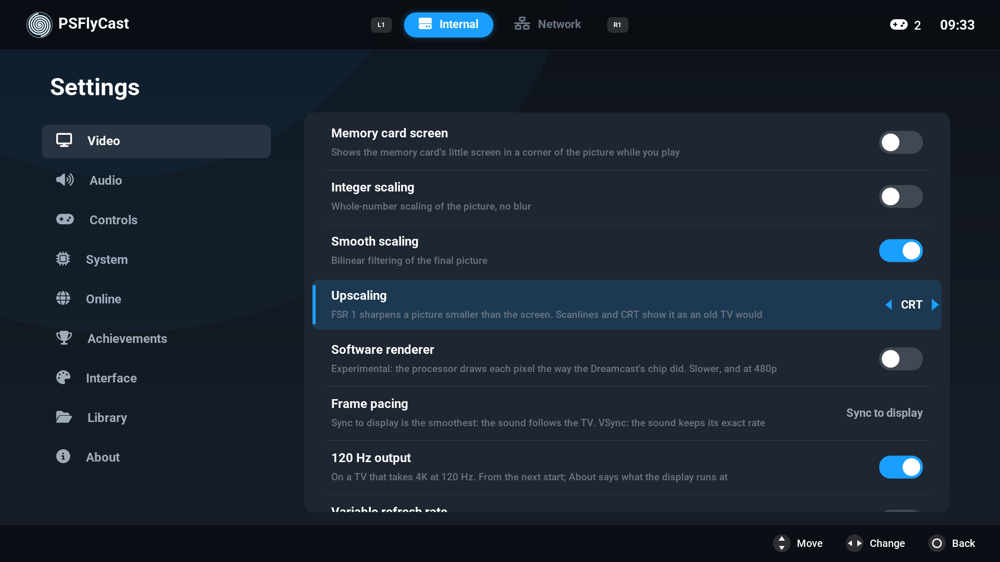

**Upscaling** (Video) has two picture filters after its FSR 1 choices.
**Scanlines** shows the game's own 240 or 480 lines the way a tube draws
them, whatever the internal resolution is and however large the picture is
drawn; **CRT** adds the tube's mask of red, green and blue stripes, its
glow and its darker corners. While one of them is chosen FSR 1 is not
used: the filter draws straight from the game's picture. The shader is
PSFlyCast's own (`shell/ps5/ps5_crt.glsl.h`). A game can have its own
choice. Not confirmed on a console yet.

**Software renderer** (Video, off by default, experimental). The game's
picture is not drawn by the console's graphics processor but computed on
its CPU, on several threads, by REFSW, a software model of the Dreamcast's
graphics chip by Stefanos Kornilios Mitsis Poiitidis (skmp). The picture is
the Dreamcast's own 480p whatever Internal resolution says, is shown the
way Full framebuffer emulation shows one, and Widescreen does nothing to
it. A NAOMI 2 game is not drawn this way (its graphics need transform and
lighting, which the model does not have), nor is any game while Netplay is
on: those are drawn as before. A game can have its own choice. Not run on
a console yet.

**Memory card screen** (Video, off by default) shows the memory card's
little screen in a corner of the picture while a game runs: Flycast's own
overlay. **Stretch to fill** (Video, off by default) stretches the 4:3
picture over the whole screen: no black bars, and everything a third
wider. It is the option Flycast gained in the commits this version takes.
Neither is confirmed on a console yet.

The Dreamcast's **language** follows the console's the first time this
version starts, where the Dreamcast has it (Japanese, English, German,
French, Spanish, Italian) and it was still English; Settings > System >
Language changes it.

**Variable refresh rate** (Video, off by default, experimental) is for a
display with VRR and 120 Hz output on: the output is asked to leave its
fixed rate, a frame is then shown as soon as it is ready, once, and the
sound paces the game. It takes effect at the next start, and About > Display
says "variable refresh" when the output took it. If the console refuses,
nothing changes. Not confirmed on a console or a TV yet.

## Online

Not confirmed on a console yet.

**A game's own online mode.** Flycast emulates the Dreamcast's modem and its
broadband adapter, and by default connects them through DCNet, its service
for the games whose servers were brought back. Up to build 39 no name could
be looked up from the title ("A non-recoverable error occurred during
database lookup"), so none of it connected. Names are now looked up by the
console's own resolver. Settings > Online > **Dreamcast online** chooses the
modem or the broadband adapter, through DCNet or directly, and **Name
online** is the name such a game signs in with, typed on the console's
keyboard.

**Netplay** is Flycast's own (GGPO): two players in one game, each on a
console or a PC running Flycast, over the home network or the internet.

1. Both: Settings > Online > **Netplay**. One is **Host: player 1**, the
   other **Join: player 2**.
2. Both: **Other player**, the other's address: its numbers set with the
   D-pad, or typed on the console's keyboard (Square), where a name on the
   network works too and is looked up. Settings > Online > This console
   shows yours. Over the internet it is the router's public address,
   and UDP port 19713 has to reach the console (forward it in the router, or
   try **Open the router's port (UPnP)**).
3. Both start the same game. Each waits on a screen of its own until the
   other is there. **Input delay** hides a slow connection.

Both need the same game file and the same BIOS, and the game must start from
the same state on both. An arcade game does when both have never changed its
settings. A Dreamcast game needs one save state, copied to both with `.net`
added to its name (`data/savestates/<game>.state.net`): Flycast compares everything
else the game would start from (the console's settings and clock, the memory
cards), and those differ between two consoles. In netplay port B is the
other player's, with a controller in it.

While Netplay is not Off, **every** game waits for another player when it
starts. Turn it off to play alone.

## Achievements

New in v1.1.0, and not confirmed on a console yet.

PSFlyCast can earn the achievements of
[RetroAchievements](https://retroachievements.org) as you play, with
Flycast's own support for the site (the rcheevos library). It needs an
account on the site, and the console's network.

- Settings > Achievements > **RetroAchievements** turns it on.
- **Account** opens the sign-in: the user name and the password are typed
  on the console's keyboard, and **Sign in** sends them to the site. The
  password is not kept. What is kept, in `emu.cfg` in PSFlyCast's folder,
  is the user name and the key (a token) the site gives in return, with
  which PSFlyCast signs in by itself from then on. That key is all a
  sign-in needs: leave `emu.cfg` out of anything you pass on. Triangle in
  the same dialog signs out.
- **Softcore only.** Save states, cheats, rewind and fast forward stay as
  they are. The site's hardcore mode, which forbids them, is not offered,
  and PSFlyCast turns it off at every start.
- In a game the site has achievements for, one that is earned is shown
  over the game as it happens, and the quick menu has **Achievements**:
  how many are earned and their points, then each one with its picture,
  what it asks for and how far along it is, in the site's own groups. When
  there is nothing to list the row says why: "Not signed in", or "None for
  this game".

With **USB drives** on, the console may refuse the connection to the site,
as it may refuse the update check: the sign-in's dialog says so.

## Updates

Seen working on a console from build 40: the release was downloaded and its
files replaced the title's. It is made so that a failure leaves the title as
it was.

Settings > About > **Check for updates** asks the project's GitHub page for
its releases. When one is newer than what is running, PSFlyCast can install
it: it downloads the release's ZIP, checks it against the SHA-256 the release
names, unpacks it, and moves each file of the title that the ZIP has to
`update/old/` and the new one into its place. If the console refuses any of
those moves, every file already moved is moved back. The new version starts
the next time PSFlyCast is opened, and that start deletes `update/`.
**Restart PSFlyCast now** asks the console to start the title again in place
of the running one; if the console only closes it (this step is not
confirmed on one), open it from the home screen. What is
yours is never touched: games, BIOS files, covers, `data/`, the settings.

A release's build also asks once as it starts and offers a newer release
(**Update now**, **Later**, **Skip this version**); About > **Look for
updates at start-up** turns that off. A test build asks only when told to,
and can install the newest release in its own place.

A **release candidate** is a release whose name ends in `-rc` and a number
(`v1.1.0-rc1`): what the release will be unless a fault shows. From v1.1.0
a release's build is offered releases only, and a candidate's build is
offered the next candidate and then the release itself. v1.0.2 does not
tell the two apart and offers a candidate like any release: **Skip this
version** there waits for the release.

If a step is refused, the dialog says so and names the reason,
`flycast-boot.log` has every step ("update: ..."), and updating by copying
the ZIP works as before. With **USB drives** on, PSFlyCast runs outside its
sandbox, where the console can refuse it HTTPS: if the update check, the
cover downloads or the achievements' sign-in fail, turn USB drives off and
start it again.

## What has been verified

On the build machine, without a console:

- The title links against RADV and is converted and fake-signed by
  PS5_Vulkan's host tool, which checks every import against the console's
  modules.
- The interface is the real code, rendered on a PC with test data (the
  screenshots).
- The network code (`shell/ps5/ps5_smb.cpp` with libsmb2) against a Samba
  server on the build machine: listing, streamed reads and reads from memory
  compared byte for byte with the files, a second open sharing the image in
  memory, cancel half way, a server paused for six seconds in the middle of a
  load (the wait is shown, the load completes), a dead address (fails in five
  seconds) and a wrong share name.
- The updater's own steps (`shell/ps5/ps5_update.cpp`), with the project's
  real releases: the list GitHub gives is read and its highest version
  taken; v1.0.1's ZIP gives the SHA-256 its release names; unpacked, every
  file is the ZIP's, byte for byte; put over a copy of v1.0.0 with a user's
  files in it, the new files are in place, the old ones in `update/old/`
  and the user's untouched; with a move refused half way, at `eboot.bin` or
  earlier, the folder ends byte for byte as it was; a ZIP with settings,
  games or paths outside the folder in it has them left out; a cut-off or
  damaged ZIP is refused. What needs a console is not covered: the download
  itself, and the moves in the title's real folder.
- The text that goes to and comes from the console's keyboard
  (`shell/ps5/ps5_ime.cpp`), against a stand-in for the dialog: the
  parameter block's layout, text with accents and non-Latin characters both
  ways, a cancelled entry, a value longer than the field.
- The home-screen sound: the same file comes out of its generator every
  time, and the loop's last sample runs into its first.
- The link's import check, new in v1.1.0: it stopped a build of this
  version that called a function no module a title loads has.
- The memory card code (`shell/ps5/ps5_vmu.cpp`), on card images made for
  the purpose: listing, copying, deleting, exporting and importing saves,
  damaged and unformatted cards, a card that changed between listing and
  acting, the backup made before a card's first change.
- Rewind's store of snapshots (`shell/ps5/ps5_rewind.cpp`), under the
  compiler's thread and memory checkers: taking, dropping, listing and
  reading back snapshots from several threads, its memory limit, and when a
  snapshot may be taken, against the emulator's own scheduler code. Not
  covered: a real game going back.
- The software renderer (`core/rend/soft/`), in a harness of its own with
  made-up frames, under the same checkers. Not covered: a real game's frames,
  and its speed on the console.
- The Scanlines and CRT shader compiles with the compiler the title uses for
  its shaders, and was drawn on a PC from test pictures.
- Frame generation (`shell/ps5/ps5_framegen.cpp`), the file itself in a
  test of its own, on a software Vulkan driver with the validation layer
  on, which had nothing to say. Test pictures with the true in-between
  picture known: a pan with something crossing it and a score that stands
  still (the made picture is 32 dB from the true one, where a plain mix of
  the two frames is 18.5 dB and build 45's was 27), a turn with a zoom, a
  fast turn behind something held still in front, a ground rushing at the
  camera, a run of six frames, three cuts to another scene (all of the made
  picture is the new scene), Light and Full with two, three and four
  presents, and two picture shapes. Not covered: a real game's pictures,
  and what it costs the console.

On a console: see Status, at the top.

## How it works

- `shell/ps5/runtime/` - the process start (clears the BSS) and the link layout.
- `shell/ps5/ps5_main.cpp` - start-up, folders, log, first-run settings.
- `shell/ps5/ps5_diag.cpp` - `flycast-boot.log` and the crash report
  (`shell/ps5/symbolize.sh` turns its offsets into functions).
- `shell/ps5/ps5_pad.cpp` - DualSense through libScePad, rumble, up to four
  pads; the touch pad and the motion sensor as a light gun's aim; the light bar.
- `shell/ps5/ps5_usbinput.cpp` - a USB keyboard and mouse (libSceKeyboard,
  libSceMouse) as Flycast's keyboard and mouse devices.
- `shell/ps5/ps5_ime.cpp` - text from the console's own keyboard
  (libSceImeDialog).
- `shell/ps5/ps5_audio.cpp` - libSceAudioOut at 48 kHz, resampled from the
  emulator's 44.1 kHz; the interface's own sounds, mixed on a port of theirs.
- `core/rend/vulkan/vulkan_context.cpp` - RADV's ICD entry point and a
  `VK_KHR_display` surface on VideoOut, as PS5_Vulkan's RADV test title drives
  it; the 4K mode with the highest refresh rate the driver offers (119.88 Hz
  where `param.json` asks for it and the display follows, else 59.94 Hz), and
  two presents a frame at 119.88 Hz, or one where the presents are counted
  and the display shows fewer than its mode says.
- `shell/ps5/ps5_fsr.cpp`, `ps5_fsr_constants.h`, `shell/ps5/fsr/` - FSR 1
  upscaling of the picture: AMD's two headers, compiled as GLSL, in two draws
  between the game's picture and the swapchain.
- `shell/ps5/ps5_crt.glsl.h` - the Scanlines and CRT picture filters: one
  fragment shader, drawn by `ps5_fsr.cpp` in place of the emulator's stretch.
- `shell/ps5/ps5_framegen.cpp` - frame generation: the way the picture moved
  between the game's last two frames is estimated, both ways round, in
  under thirty small draws, and the
  presents that would repeat a frame show a picture made in between
  (`vulkan_context.cpp` asks it what to show in each present). PSFlyCast's
  own; the comment at its top says how it works.
- `shell/ps5/ps5_perf.cpp` - how fast a game really runs: the emulated
  clock against the console's, the pictures drawn, shown and made, for the
  frame-rate overlay and the boot log.
- `core/rend/soft/` - the software renderer: REFSW's tiles
  (`refsw_tile.cpp`), fed from Flycast's parsed frame by `soft_renderer.cpp`
  and writing the emulated video memory, which is shown as full framebuffer
  emulation shows it (`core/hw/pvr/Renderer_if.cpp`).
- `core/linux/posix_vmem.cpp` - guest memory and JIT code in direct memory
  through the PS5 payload SDK fork's platform layer (`ps5platform/shm.h`,
  `ps5platform/exec.h`), with fastmem.
- `shell/ps5/bigpicture.cpp` - the interface, with the memory card
  manager's screen (`bigpicture_cards.inc`), the achievements' account
  (`bigpicture_achievements.inc`) and three of the four start-up animations
  (`bigpicture_splash.inc`).
- `shell/ps5/ps5_library.cpp` - what the library keeps about each game
  (`data/library.txt`): favourite, hidden, time played, last played, and
  which covers PSFlyCast put in `covers/` itself.
- `shell/ps5/ps5_rewind.cpp` - rewind: the snapshots, taken on the
  emulator's thread between two of the processor's time slices, compressed
  with zstd on a thread of their own, and loaded as a save state is.
- `shell/ps5/ps5_vmu.cpp` - the memory card manager's reading and writing
  of the card images and of `.vmi`, `.vms` and `.dci` files.
- `shell/ps5/sce_sys/` - the title's name, its icon and `pic0.dds`, the
  picture the console shows behind the title and while it loads (4K, BC7):
  the start-up animation's first frame, made with PS5_Vulkan's
  `tools/prepare-assets.sh --background`.
- `shell/ps5/ps5_smb.cpp` - SMB shares as a Flycast storage (libsmb2), games
  read into memory or streamed.
- `shell/ps5/ps5_drawdist.cpp`, `ps5_drawdist_scan.h` - the object draw
  distance option.
- `shell/ps5/ps5_covers.cpp`, `ps5_cheats.cpp`, `ps5_pipelines.cpp` - cover
  downloads and the choice of covers, `.cht` cheat files, the per-game
  shader warm-up. `ps5_covers.cpp` is also Flycast's HTTP client on the
  console (libSceHttp2), which the descriptions and the achievements use.
- `shell/ps5/elevation/` - the USB helper.
- `shell/ps5/ps5-link.sh` - the link: PS5_Vulkan's RADV title recipe, with
  import libraries made at link time for what the SDK has none for
  (`shell/ps5/runtime/stubs`: the mouse, the common dialogs, and one more
  name of the video output's). Before the title is signed it lists what the
  linked file imports, and refuses a name that only `libkernel_sys` or
  `libScePosixForWebKit` export: a title loads neither, so the import would
  be null at run time.
- `shell/ps5/ps5-toolchain.cmake` - the cross-compile: for the console's
  processor (`-march=znver2`), with floating point left as on every other
  x86-64 build of Flycast (`-ffp-contract=off`).

## Building

On Linux with clang 18, lld 18, CMake, Ninja and Python 3. From v1.1.0 the
title is built on the stack of
[PS5_VulkanTemplate](https://github.com/mihawk-99/PS5_VulkanTemplate): its
`ps5/tools/bootstrap.sh` checks out and builds what a title links, and its
`ps5/tools/setup-sdk.sh` pins the payload SDK. The repositories sit side by
side in one folder:

```sh
git clone --recursive <this repository's URL> PSFlyCast
git clone https://github.com/mihawk-99/PS5_VulkanTemplate
git clone https://github.com/mihawk-99/PS5_Vulkan
git clone https://github.com/mihawk-99/PS5_Mesa
git clone https://github.com/mihawk-99/PS5_PayloadSDK
git clone https://github.com/sahlberg/libsmb2
git clone https://github.com/libretro/libretro-database     # optional: the cheat files

# PS5_Vulkan and libsmb2 at the revisions this version is built with.
git -C PS5_Vulkan checkout 5b5e4fc2d80fdb67a4f61ba9e6a8a424026bb8a5
git -C libsmb2 checkout 7e4ff97cf00edb288b6b763888e4326842afdc76

# RADV, with the display-mode patches of this repository (119.88 Hz on a VRR
# display, PS5_VIDEOOUT_59HZ; variable refresh, PS5_VIDEOOUT_VRR). They are
# made on PS5_Mesa 7b59ef2, the revision that PS5_Vulkan pins.
git -C PS5_Mesa checkout -b psflycast 7b59ef27c1b09b9671bc4153c41940c3155c3af2
git -C PS5_Mesa am ../PSFlyCast/shell/ps5/mesa/*.patch
sed -i "s/^mesa_revision=.*/mesa_revision=$(git -C PS5_Mesa rev-parse HEAD)/" PS5_Vulkan/tools/build-radv.sh

# The rest of the stack, each part only where it is missing: PS5_Vulkan's
# own payload SDK (b83202b, which RADV is compiled with), its host tool and
# libc.prx (make), the RADV release archive at the revision set above
# (tools/build-radv.sh release: a long build, which needs LLVM/Clang 18,
# libclc, llvm-spirv, meson and mako), and the payload SDK the template
# pins: PS5_PayloadSDK at 611893f, installed in
# PS5_VulkanTemplate/.deps/native/ps5-payload-sdk, where build.sh looks for
# it.
PS5_VulkanTemplate/ps5/tools/bootstrap.sh

# The title itself is compiled with the fork one commit on, b5efad5 (a fix to
# how wide characters are classed), installed the way the fork's own script
# does it, in a folder of its own that PS5_PAYLOAD_SDK names to build.sh.
sdk=b5efad528e0ac1b8289f39d72a0e890ff68ff0a6
mkdir -p sdk-psflycast sdk-tree
git -C PS5_PayloadSDK archive $sdk | tar -x -C sdk-tree
bash sdk-tree/platform/tools/setup-sdk.sh "$PWD/sdk-psflycast/ps5-payload-sdk" $sdk "$PWD/sdk-psflycast"

cd PSFlyCast
PS5_PAYLOAD_SDK=$PWD/../sdk-psflycast/ps5-payload-sdk shell/ps5/build.sh               # -> build-ps5/dist/PPSA99247
```

`bootstrap.sh` also checks the host for what the template's own titles need
(glslangValidator, curl, zstd, numpy and Pillow among them), builds
PS5_Vulkan's control payload, and looks for the console's address
(`PS5_HOST` in PS5_Vulkan's `.env`), which only the console tools use:
without one it ends by saying that this is left to do, after everything
else is built.

`build.sh` stops before compiling when a part is missing (the SDK's
compiler, the RADV release archive, the host tool, or `libc.prx`, whose
SHA-256 it checks against the one PS5_Vulkan records) or when the payload
SDK is older than the pin (it looks for the platform layer's
`ps5_localeconv` and `ps5_readlink`). The link (`ps5-link.sh`) then refuses
a title that imports a function no module a title loads exports.

v1.1.0 and its two candidates are made with PS5_Vulkan `5b5e4fc`, PS5_Mesa `7b59ef2` plus the
two patches, the payload SDK fork at `b5efad5` and libsmb2 `7e4ff97`; RADV's
archive is compiled with the SDK at `b83202b`. (PS5_Mesa's two commits after
`7b59ef2` change its OpenGL-on-Vulkan driver, which is not in the title:
RADV is as it was.) v1.0.0 to v1.0.2 were made with PS5_Vulkan
`3f3ee69`, PS5_Mesa `0b2d6d1` plus the patches (one up to v1.0.1, two from
v1.0.2), and the payload SDK fork at `cd3b239`. (Those two repositories'
histories were rewritten by their author on 2026-10-05 and every commit got
a new id: the same trees are now `504adad` and `a9ca6bd`.) `BUILD.txt` in
the title's folder names what a build was made from.

## Credits and licences

What is in this build, and whose it is:

| Part | From | Licence |
|---|---|---|
| The emulator | [Flycast](https://github.com/flyinghead/flycast), by flyinghead and contributors | GPL-2.0-or-later |
| The Vulkan driver, and the tool that links and signs the title | Mesa's RADV as ported in [PS5_Vulkan](https://github.com/mihawk-99/PS5_Vulkan) and [PS5_Mesa](https://github.com/mihawk-99/PS5_Mesa), by Mihawk-99 | GPL-3.0-or-later; Mesa under its own licences |
| The title's start-up, link layout and `libc.prx`; the platform layer (heap, guest memory, the libc functions a title lacks) | Mihawk-99's fork of the payload SDK; [ps5-payload-sdk](https://github.com/ps5-payload-dev/sdk) by John Törnblom and contributors | GPL-3.0-or-later |
| USB drive access (`sandbox-elevator.elf` and its client) | The sandbox-elevation example of ps5-native-app-boilerplate, by BlackBearReloaded | GPL-3.0 |
| Network shares | [libsmb2](https://github.com/sahlberg/libsmb2), by Ronnie Sahlberg | LGPL-2.1 |
| Upscaling (`shell/ps5/fsr`) | [FidelityFX Super Resolution 1.0](https://github.com/GPUOpen-Effects/FidelityFX-FSR), by AMD | MIT |
| The software renderer's model of the Dreamcast's graphics chip (`core/rend/soft/refsw_*`) | REFSW, by Stefanos Kornilios Mitsis Poiitidis (skmp), from [nullDC-rust](https://github.com/skmp/nullDC-rust) | MIT |
| Achievements | [rcheevos](https://github.com/RetroAchievements/rcheevos), by RetroAchievements.org, as Flycast carries it | MIT |
| The cheat files | [libretro-database](https://github.com/libretro/libretro-database), `cht/Sega - Dreamcast` | CC BY-SA 4.0 |
| The mark, the icon, the start-up animations and their sound, the menu sounds and the home-screen sound | PSFlyCast's own: `shell/ps5/bigpicture.cpp`, `shell/ps5/bigpicture_splash.inc`, `shell/ps5/sce_sys/make-icon.py`, `shell/ps5/sounds/startup.wav` (by Press5elect), `shell/ps5/sounds/make-home-sound.py` | GPL-3.0-or-later |
| Covers, downloaded when PSFlyCast runs | [libretro-thumbnails](https://github.com/libretro-thumbnails/Sega_-_Dreamcast) | |
| Descriptions and release dates, downloaded when PSFlyCast runs | [TheGamesDB](https://thegamesdb.net), with Flycast's own scraper and its key | |

The console's calls for the keyboard on the screen, a USB keyboard and
mouse, the controller's motion sensor and light bar, and variable refresh
are made the way BlackBearReloaded's open projects make them (ProsperoLight,
ProsperoStore, ProsperoTV), which is where I read how; the code here is
PSFlyCast's own. The home-screen sound was encoded to ATRAC9 with
BlackBearReloaded's [ps5-at9-converter](https://github.com/blackbearreloaded/ps5-at9-converter),
a tool: none of it is in the build.

ShadowMountPlus (drakmor, after VoidWhisper's ShadowMount) is what mounts and
starts the title on the console; none of it is in the build either.

The build stack is that of
[PS5_VulkanTemplate](https://github.com/mihawk-99/PS5_VulkanTemplate), by
Mihawk-99: which revisions of PS5_Vulkan, PS5_Mesa and the payload SDK fork
go together, the script that installs the SDK at its pin, and the link's
check for imports that would be null, which `ps5-link.sh` makes the way the
template does. Its tools are under the MIT licence; they build the title
and are not in it.

The achievements themselves, their pictures and the account belong to
[RetroAchievements](https://retroachievements.org), and are asked for when
PSFlyCast runs; none of them comes with it.

Flycast compiles a number of libraries in with it (Dear ImGui, glslang,
libchdr, FreeType, xBRZ, picoTCP and others), and the title links the LLVM
runtime and zlib. `licenses/README.txt` in the title's folder lists every
part, its licence, its source and the revision it was built from, and
`licenses/` holds the licence texts.

The combined app is distributed under the GPL, version 3, with no warranty.
Each release has the complete source of everything in it attached, beside
the ZIP.

This is an independent project, not affiliated with or endorsed by Sony
Interactive Entertainment, Sega or the Flycast project. "PlayStation" and
"PS5" are trademarks of Sony Interactive Entertainment; "Dreamcast" is a
trademark of Sega. Vulkan is a registered trademark of the Khronos Group, and
the RADV port in this title is not a conformant product. Use your own games
and BIOS.
